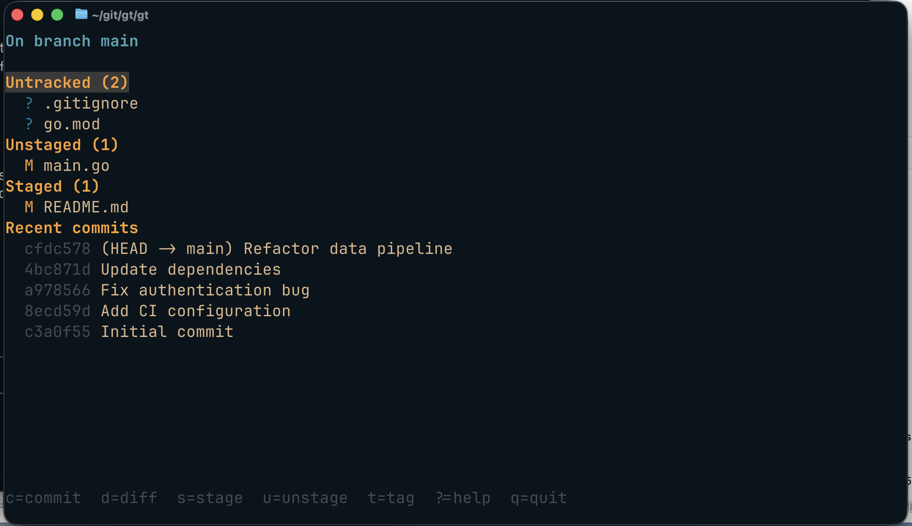

# gt

A fast, keyboard-driven TUI for the git operations you actually do every day. Inspired by fond memories of [mutt](http://www.mutt.org/) — a single dense screen, vim-style navigation, and tag-and-act selection so you can stage, diff, and commit without touching the mouse.



## Features

- See untracked, unstaged, staged files and recent commits on one screen
- `d` on any row to diff it — file, whole section, or a commit
- `s` / `u` to stage / unstage files or entire sections
- Tag multiple files with `t`, then act on all of them with `;s`, `;u`, or `;d`
- Inline commit prompt; `Ctrl-g` drops into `$EDITOR` for longer messages
- Respects your gitconfig: pager, colors, hooks, signing

## Build

```sh
go build -ldflags="-s -w" -o gt ./cmd/gt/
```

Requires Go 1.21+. No other dependencies to install — everything is statically linked.

Optionally put the binary somewhere on your `$PATH`:

```sh
mv gt /usr/local/bin/gt
```

## Usage

Run `gt` inside any git repository:

```sh
gt
```

### Key bindings

| Key | Action |
|---|---|
| `j` / `k` | down / up |
| `g` / `G` | top / bottom |
| `Ctrl-d` / `Ctrl-u` | half page down / up |
| `d` | diff at cursor (file, section, or commit) |
| `s` | stage at cursor |
| `u` | unstage at cursor |
| `t` | toggle tag on row |
| `;s` / `;u` / `;d` | stage / unstage / diff all tagged |
| `T` | clear all tags |
| `c` | open commit prompt (`Ctrl-g` for `$EDITOR`, `Esc` to cancel) |
| `R` | refresh |
| `?` | help |
| `q` / `Ctrl-c` | quit |

Cursor targets are context-aware: pressing `d` on a section header diffs the whole section; pressing `s` on the Unstaged header stages everything unstaged.
